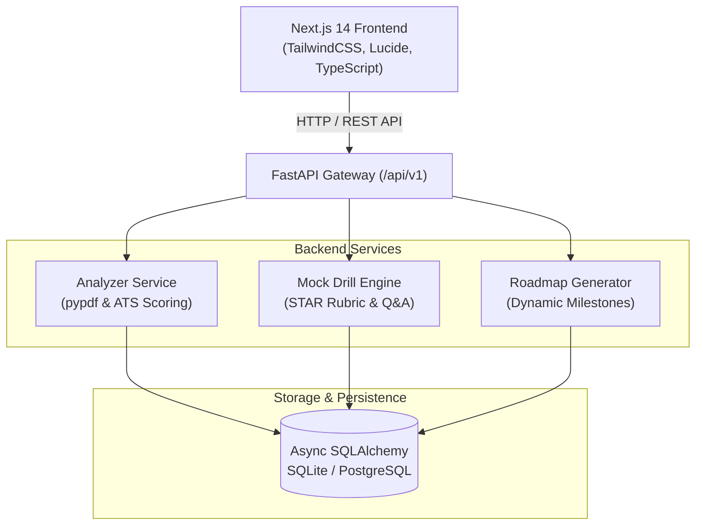

# CareerForge AI 🚀

[](https://fastapi.tiangolo.com)
[](https://nextjs.org/)
[](https://www.typescriptlang.org/)
[](https://python.org)
[](https://www.sqlalchemy.org/)

**CareerForge AI** is an intelligent full-stack career acceleration platform designed to empower software engineers and tech professionals. It unifies **ATS Resume Diagnostics & Gap Analysis**, **AI Voice & Text Mock Interview Drills**, and **Dynamic Personalized Learning Roadmaps** to bridge the gap between candidate qualifications and top-tier job requirements.

---

## 📑 Table of Contents

- [Key Features](#-key-features)
- [System Architecture](#-system-architecture)
- [Project Directory Structure](#-project-directory-structure)
- [Quick Start Guide](#-quick-start-guide)
  - [1. Backend Setup (FastAPI)](#1-backend-setup-fastapi)
  - [2. Frontend Setup (Next.js)](#2-frontend-setup-nextjs)
- [API Reference](#-api-reference)
  - [Resume Analyzer Endpoints](#resume-analyzer-endpoints)
  - [Mock Interview Engine Endpoints](#mock-interview-engine-endpoints)
  - [Dynamic Roadmap Endpoints](#dynamic-roadmap-endpoints)
- [Environment Configuration](#-environment-configuration)
- [License](#-license)

---

## 🌟 Key Features

1. **📄 ATS Resume Diagnostics & PDF Parsing (`analyzer.py`)**
   - High-throughput binary PDF stream extraction via `pypdf`.
   - Algorithmic ATS scoring benchmarked against target roles (Full Stack, Backend, Data/ML).
   - Detects quantified metrics (`%`, `ms`, `$`, scale multipliers) and strong action verbs.
   - Real-time bullet point optimizer that rewrites passive descriptions into high-impact STAR deliverables.
   - Job description keyword gap matcher.

2. **🎙️ Mock Drill Q&A Engine (`interview.py`)**
   - Curated drill bank spanning System Architecture, Frontend Internals, Databases, and STAR Behavioral questions.
   - Real-time rubric evaluation evaluating technical depth, conceptual accuracy, and STAR methodology.
   - Interactive conversation turns with immediate feedback, scoring, and dynamic follow-up questions.
   - Session reporting and cumulative scorecards.

3. **🗺️ Dynamic Milestone Generator (`roadmap.py`)**
   - Automatically synthesizes tailored learning tracks based on candidate resume deficiencies.
   - Phase-by-phase milestones: Foundations → Core Stack → High Scale & Distributed Systems → Cloud Reliability → Placement Capstone.
   - Interactive task tracking with completion status persistence.

---

## 🏗️ System Architecture



---

## 📁 Project Directory Structure

```text
anshu/
├── backend/
│   ├── app/
│   │   ├── api/
│   │   │   ├── __init__.py        # Aggregated versioned API router
│   │   │   ├── analyzer.py        # PDF parser, ATS gap detection & bullet optimizer
│   │   │   ├── interview.py       # Mock drill Q&A engine with STAR scoring
│   │   │   └── roadmap.py         # Dynamic milestone & task generator
│   │   ├── core/
│   │   │   ├── __init__.py
│   │   │   ├── config.py          # Pydantic Settings & environment parsing
│   │   │   ├── database.py        # Async SQLAlchemy engine & session factory
│   │   │   └── security.py        # Cryptographic tokens & security utilities
│   │   ├── models/
│   │   │   ├── __init__.py        # Model registry exports
│   │   │   ├── interview.py       # InterviewSession & Message ORM models
│   │   │   ├── resume.py          # ResumeAnalysis ORM model
│   │   │   └── roadmap.py         # Roadmap, Milestone & Task ORM models
│   │   ├── __init__.py
│   │   └── main.py                # FastAPI entry point, CORS & lifespan
│   ├── tests/
│   │   └── test_api.py            # Automated test suite
│   ├── requirements.txt           # Python dependencies
│   └── .env.example               # Template environment configuration
│
├── frontend/                      # Next.js 14 Web Application
│   ├── app/                       # App Router (analyzer, interview, roadmap, jobs)
│   ├── components/                # Modular UI components (dropzones, visualizers, radar)
│   └── package.json
│
├── LICENSE                        # Open-source MIT License
└── README.md                      # Project documentation
```

---

## 🚀 Quick Start Guide

### Prerequisites
- **Python**: 3.10 or higher
- **Node.js**: 18.17 or higher
- **Package Managers**: `pip` and `npm`

---

### 1. Backend Setup (FastAPI)

1. Navigate to the backend directory:
   ```bash
   cd backend
   ```

2. Create and activate a Python virtual environment:
   - **Windows (PowerShell)**:
     ```powershell
     python -m venv venv
     .\venv\Scripts\Activate.ps1
     ```
   - **Linux / macOS**:
     ```bash
     python3 -m venv venv
     source venv/bin/activate
     ```

3. Install required packages:
   ```bash
   pip install -r requirements.txt
   ```

4. Configure environment variables:
   - **Windows**:
     ```powershell
     copy .env.example .env
     ```
   - **Linux / macOS**:
     ```bash
     cp .env.example .env
     ```

5. Launch the FastAPI development server:
   ```bash
   uvicorn app.main:app --reload --host 0.0.0.0 --port 8000
   ```

6. Open your browser:
   - **Interactive Swagger API Docs**: [http://localhost:8000/docs](http://localhost:8000/docs)
   - **ReDoc Documentation**: [http://localhost:8000/redoc](http://localhost:8000/redoc)
   - **Health Probe**: [http://localhost:8000/health](http://localhost:8000/health)

---

### 2. Frontend Setup (Next.js)

1. In a separate terminal, navigate to the frontend directory:
   ```bash
   cd frontend
   ```

2. Install dependencies:
   ```bash
   npm install
   ```

3. Start the Next.js development server:
   ```bash
   npm run dev
   ```

4. Visit the web app in your browser: [http://localhost:3000](http://localhost:3000)

---

## 📡 API Reference

All backend endpoints are prefixed with `/api/v1`.

### Resume Analyzer Endpoints

#### 1. Upload & Analyze Resume
`POST /api/v1/analyzer/upload`  
*Content-Type: `multipart/form-data`*

**Parameters:**
- `file`: Resume file (`.pdf` or `.txt`)
- `role`: Target career track (`"software"` or `"data"`)

**Sample Response (`200 OK`):**
```json
{
  "id": "e2a9b3d1-42fa-48ef-b021-3962b489d812",
  "fileName": "Anshu_Jha_SDE_Resume.pdf",
  "targetRole": "Full Stack Software Engineer",
  "score": 84,
  "skills": ["React.js", "Next.js", "TypeScript", "Node.js", "PostgreSQL", "REST APIs"],
  "missing": ["Redis", "Docker", "System Design", "Unit Testing", "AWS / Cloud"],
  "strengths": [
    "Strong core technical breadth: Identified 6 matching stack competencies.",
    "Quantifiable impact: Identified 4 distinct outcome metrics and KPIs."
  ],
  "improvements": [
    "Target key tech gaps: Infuse high-yield keywords such as Redis, Docker, System Design.",
    "Quantify outcomes: Add specific performance metrics (e.g. latency reduced by X%)."
  ],
  "bulletOptimizations": [
    {
      "role": "Full Stack Web Application",
      "before": "Created full stack shopping website using React and Node.js with database integration.",
      "after": "Architected scalable full-stack e-commerce platform using Next.js 14, TypeScript, and PostgreSQL; reduced query latency by 38% via Redis caching.",
      "impact": "+18 ATS Keyword Match"
    }
  ]
}
```

#### 2. Optimize Bullet Point
`POST /api/v1/analyzer/optimize-bullet`  
*Content-Type: `application/json`*

```json
{
  "bullet": "Worked on backend APIs and fixed slow database queries.",
  "targetRole": "Full Stack Software Engineer",
  "contextProject": "E-Commerce Microservice"
}
```

#### 3. Match with Job Description
`POST /api/v1/analyzer/match-job`  
*Content-Type: `application/json`*

```json
{
  "resumeText": "Experienced with React, Node, PostgreSQL, and TypeScript...",
  "jobDescription": "Looking for a Senior Engineer with Redis caching, Docker, and Kubernetes experience...",
  "roleTitle": "Senior Full Stack Engineer"
}
```

---

### Mock Interview Engine Endpoints

#### 1. Start Interview Session
`POST /api/v1/interview/start`

```json
{
  "candidateName": "Anshu",
  "targetRole": "Full Stack Software Engineer",
  "difficulty": "Mid-Senior"
}
```

#### 2. Submit Answer & Receive Rubric Assessment
`POST /api/v1/interview/{session_id}/answer`

```json
{
  "questionId": "q1",
  "answerText": "To prevent cache stampede, I would use a distributed mutex lock so only a single thread rebuilds the cache on a miss. Additionally, I add TTL jitter to avoid simultaneous key expiration."
}
```

**Sample Response (`200 OK`):**
```json
{
  "sessionId": "4bb9b30c-15a4-44ee-b7d6-dfb5c102a981",
  "questionId": "q1",
  "evaluation": {
    "score": 92,
    "strengths": [
      "Accurate terminology: Correctly referenced mutex, lock, ttl jitter.",
      "Structured technical articulation with clear conversational cadence."
    ],
    "missingConcepts": [],
    "rubricTips": "Mention Cache-Aside vs Write-Through, Mutex/Locks for Stampede, TTL jitter.",
    "feedback": "Exceptional response! You demonstrated strong architectural intuition and addressed potential concurrency pitfalls."
  },
  "nextQuestion": {
    "id": "q2",
    "category": "Frontend Deep Dive",
    "difficulty": "Mid-Senior",
    "question": "Explain how React 18 Concurrent Rendering and Server Components change data fetching..."
  }
}
```

#### 3. Get Full Session Scorecard
`GET /api/v1/interview/{session_id}`

---

### Dynamic Roadmap Endpoints

#### 1. Generate Custom Roadmap
`POST /api/v1/roadmap/generate`

```json
{
  "targetRole": "Full Stack Software Engineer",
  "missingSkills": [
    "System Design (Caching/Redis)",
    "Docker & Containerization",
    "Unit Testing (Jest/Playwright)"
  ],
  "weeklyCommitmentHours": 15
}
```

#### 2. Toggle Task Status
`PATCH /api/v1/roadmap/task/{task_id}/toggle`

---

## ⚙️ Environment Configuration

| Variable | Default Value | Description |
| :--- | :--- | :--- |
| `PROJECT_NAME` | `CareerForge AI API` | Display name for API & OpenAPI docs |
| `ENVIRONMENT` | `development` | Runtime environment (`development` or `production`) |
| `DEBUG` | `True` | Enables debug mode and tracebacks |
| `API_V1_PREFIX` | `/api/v1` | URL prefix for versioned endpoints |
| `HOST` | `0.0.0.0` | Host interface binding |
| `PORT` | `8000` | Port for the Uvicorn server |
| `CORS_ORIGINS` | `http://localhost:3000,http://127.0.0.1:3000` | Allowed origins for web client |
| `DATABASE_URL` | `sqlite+aiosqlite:///./careerforge.db` | Async database connection string |
| `SECRET_KEY` | *(Random secret string)* | Secret key for cryptographic operations |

---

## 🧪 Testing

To run the backend test suite:
```bash
cd backend
pytest -v
```

---

## 📄 License
This project is open-source and available under the [MIT License](LICENSE).
